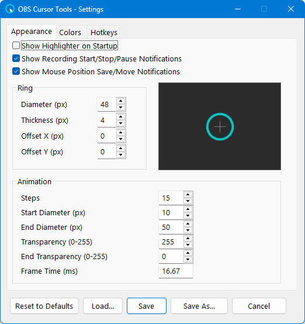
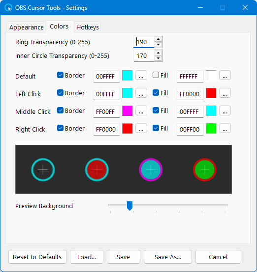
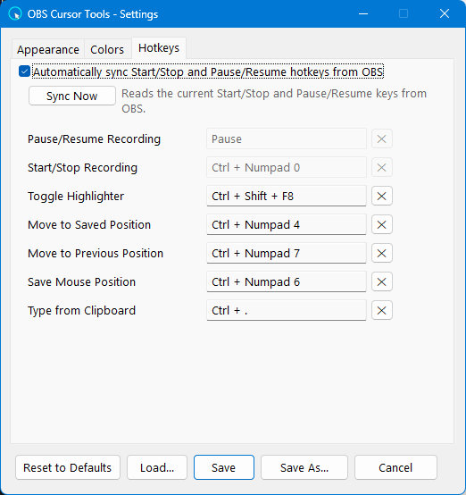

# OBS Cursor Tools

[](https://www.autohotkey.com/)
[](https://www.microsoft.com/windows)
[](LICENSE)
[](https://github.com/mesutakcan/OBS-Cursor-Tools/releases)


[](https://github.com/mesutakcan/OBS-Cursor-Tools/releases)

Make your mouse easy to follow in screen recordings.

OBS Cursor Tools is a Windows utility written in AutoHotkey v2. It displays a configurable cursor ring, changes the ring and fill for left/middle/right clicks, animates clicks, and provides shortcuts for recording workflows. OBS Studio is optional; it is used when you want the application to synchronize recording hotkeys automatically.

## Features

- Displays a highlighter ring and optional inner fill around the cursor.
- Uses separate colors and border/fill visibility settings for the default state and each mouse button.
- Shows an expanding click animation after a left, middle, or right click.
- Reads OBS Start/Stop and Pause/Unpause hotkeys automatically, or synchronizes them manually.
- Shows optional on-screen notifications for recording and mouse-position actions.
- Stores up to five mouse positions and lets you move back through the saved history.
- Types clipboard text line by line; pairs of spaces are converted to tabs, and `Esc` cancels the operation.
- Includes a Settings window with Appearance, Colors, and Hotkeys tabs.
- Saves and loads named settings profiles.

## Download and install

### Compiled release

1. Open the [Releases](https://github.com/mesutakcan/OBS-Cursor-Tools/releases) page.
2. Download the executable that matches your Windows architecture:
   - `OBS-Cursor-Tools-x64.exe` for 64-bit Windows.
   - `OBS-Cursor-Tools-x32.exe` for 32-bit Windows.
3. Run the downloaded executable.
4. The application will continue running in the notification area near the clock.

The compiled executable contains the AutoHotkey source and included library code. The application icon is embedded during the build, so the release executable does not need the `lib` folder or a separate `app_icon.ico` file. `settings.ini` is optional: if it is missing, the built-in defaults are used. Profiles are created in a `profiles` folder next to the executable when you save one.

### Run from source

Install [AutoHotkey v2](https://www.autohotkey.com/), then keep the source files in this layout:

```text
src/
├── OBS-Cursor-Tools.ahk
├── app_icon.ico
└── lib/
    ├── anim.ahk
    ├── gdip.ahk
    ├── graphics.ahk
    ├── hotkeyplus.ahk
    ├── mouse.ahk
    ├── paste.ahk
    └── settings.ahk
```

Run `src/OBS-Cursor-Tools.ahk` with AutoHotkey v2. The main script includes the files in `src/lib/` by name, so renaming or moving them without updating the `#Include` lines will prevent the source version from starting.


## Quick start

1. Start OBS Cursor Tools. Start OBS Studio too if you want OBS hotkey synchronization.
2. Right-click the tray icon and open **Settings** if you want to change the defaults.
3. Turn the highlighter on with <kbd>Ctrl+Shift+F8</kbd>.
4. Move and click normally. The ring and click animations will appear over the screen.
5. Start/stop or pause/resume recording from OBS, or use the corresponding synchronized hotkey.
6. Turn the highlighter off with the same toggle hotkey when you are finished.

The application runs in the background. Right-click its notification-area icon to open the menu.

## Default hotkeys

| Action | Default hotkey |
|---|---|
| Turn highlighter on/off | <kbd>Ctrl+Shift+F8</kbd> |
| Save mouse position | <kbd>Ctrl+Numpad6</kbd> |
| Move to saved position | <kbd>Ctrl+Numpad4</kbd> |
| Move to previous position | <kbd>Ctrl+Numpad7</kbd> |
| Start/stop recording | Read from OBS; fallback <kbd>Ctrl+Numpad0</kbd> |
| Pause/resume recording | Read from OBS; fallback <kbd>Pause</kbd> |
| Type from clipboard | <kbd>Ctrl+.</kbd> |

The actual hotkeys currently in use are shown in the tray menu under **Hotkeys**. The Settings window can capture a new combination directly. Recording hotkeys are passed through to OBS, so OBS can receive the same key combination.

## OBS Studio setup

When synchronization is enabled, OBS Cursor Tools reads the hotkeys from the standard OBS configuration under:

```text
%APPDATA%\obs-studio\basic\profiles\
```

The application uses the profile selected in OBS when it can identify it. If that information is unavailable, it can fall back to the only profile or the most recently modified profile containing `basic.ini`. Portable OBS installations and custom configuration locations are not detected automatically.

For synchronization to work reliably:

- OBS **Start Recording** and **Stop Recording** must use the same hotkey.
- OBS **Pause Recording** and **Unpause Recording** must use the same hotkey.
- The OBS profile must contain the relevant hotkey assignments.

If the two actions in a pair use different keys, the application shows a mismatch warning and keeps the previous values from `settings.ini`. If no OBS profile can be read, the values in `settings.ini` are used; if that file is also missing, the built-in fallback hotkeys are used.

You can synchronize in three ways:

- **Automatic:** enabled by default and checked when the application starts.
- **Tray menu:** choose **Sync Hotkeys from OBS**. If values change, the application offers to restart so the new hotkeys can be registered.
- **Settings window:** use **Sync Now**, then click **Save** and restart when prompted.

## Notification-area menu

Right-click the application icon to access:

- **About**: View version and project information.
- **Hotkeys**: View the current hotkey assignments.
- **Settings**: Open the Settings window.
- **Sync Hotkeys from OBS**: Re-read the OBS recording hotkeys.
- **Pause Program**: Turn off the highlighter and suspend all hotkeys without closing the app.
- **Suspend Hotkeys**: Suspend hotkeys while leaving the highlighter visible if it was enabled.
- **Toggle Highlighter**: Turn cursor highlighting on or off.
- **Save mouse position**: Add the current cursor position to the five-position history.
- **Move mouse to saved position**: Return to the newest saved position.
- **Move mouse to previous position**: Move backward through saved positions.
- **Start/stop recording**: Use the configured recording hotkey.
- **Pause/resume recording**: Use the configured pause hotkey.
- **Type from clipboard**: Type the clipboard text using the indentation behavior described above.
- **Restart**: Restart the application.
- **Exit**: Close the application.

## Settings window

Open **Settings** from the tray menu to change the application without editing files by hand.

The window has three tabs:

- **Appearance**: Ring diameter, thickness, X/Y offset, click-animation size, frame count, frame time, animation alpha, startup behavior, and notification switches.
- **Colors**: Ring and fill colors for the default state and left, middle, and right clicks. Border and fill can be shown or hidden independently. A live preview is included.
- **Hotkeys**: Press the desired key combination directly. Conflicting assignments are detected and block saving until they are resolved. This tab also contains the OBS synchronization switch and **Sync Now**.

The buttons at the bottom behave as follows:

- **Save**: Writes the form to `settings.ini` and offers to restart the application. A restart is required for the running graphics and hotkey registrations to use the new values.
- **Save As...**: Saves the form as a named `.ini` profile.
- **Load...**: Loads a profile into the form. Click **Save** afterward to apply it to the application.
- **Reset to Defaults**: Restores the built-in defaults in the form.
- **Cancel**: Closes the window without saving.

Profiles are stored in a `profiles` folder next to the script or executable. The folder is created when the first profile is saved.

[](docs/settings_ss_1.png)
[](docs/settings_ss_2.png)
[](docs/settings_ss_3.png)

## Changing settings manually

The Settings window is recommended for normal use. To edit `settings.ini` directly:

1. Exit OBS Cursor Tools.
2. Open `settings.ini` in a text editor.
3. Change the required values.
4. Save the file.
5. Start OBS Cursor Tools again.

Back up `settings.ini` before making manual changes. Hotkeys use AutoHotkey v2 syntax: `^` = Ctrl, `!` = Alt, `+` = Shift, and `#` = Win. For example, `^+F8` means Ctrl+Shift+F8.

## Settings reference

The following tables document the keys read from `settings.ini`. Values not present in the file use the defaults shown below.

### `[Hotkeys]`

| Key | Meaning | Default |
|---|---|---|
| `toggleHighlight` | Turns the cursor highlighter on/off | `^+F8` |
| `moveMousePos` | Moves the cursor to the newest saved position | `^Numpad4` |
| `movePrevMousePos` | Moves the cursor to the previous saved position | `^Numpad7` |
| `saveMousePos` | Saves the current cursor position | `^Numpad6` |
| `handlePause` | Pauses/resumes recording | `Pause` |
| `handleRecording` | Starts/stops recording | `^Numpad0` |
| `typeFromClipboard` | Types the clipboard text | `^.` |

### `[Conf]`

Alpha values range from `0` (invisible) to `255` (fully opaque).

| Key | Meaning | Default |
|---|---|---|
| `diameter` | Outer diameter of the highlighter ring, in pixels | `48` |
| `thickness` | Ring border thickness, in pixels | `4` |
| `ringTransparency` | Ring alpha | `190` |
| `circleTransparency` | Inner-fill alpha | `170` |
| `animTransparency` | Click-animation alpha at the start | `255` |
| `endTransparency` | Click-animation alpha at the end | `0` |
| `steps` | Number of click-animation steps | `15` |
| `startDiameter` | Click-animation diameter at the start, in pixels | `10` |
| `endDiameter` | Click-animation diameter at the end, in pixels | `50` |
| `animTargetFrameTime` | Target time per animation step, in milliseconds | `16.67` |
| `offsetX` | Horizontal ring offset in pixels; negative is left | `0` |
| `offsetY` | Vertical ring offset in pixels; negative is up | `0` |
| `showOnStartup` | Turns the highlighter on when the app starts | `0` |
| `showRecordingNotifications` | Shows recording start/stop/pause notifications | `1` |
| `showMousePosNotifications` | Shows mouse-position save/previous-position notifications | `1` |
| `syncHotkeysFromOBS` | Reads recording hotkeys from OBS at startup | `1` |

### `[Colors]`

Color entries are written as `0xAARRGGBB`. The Settings window edits the six-digit `RRGGBB` portion. Rendering uses the RGB portion of each value; opacity is controlled by the alpha settings in `[Conf]` and by the border/fill visibility flags below.

| Key | Meaning | Default |
|---|---|---|
| `defaultBack` | Fill color when no button is pressed | `0x00FFFFFF` (white RGB; fill hidden by default) |
| `defaultBorder` | Ring color when no button is pressed | `0xFF00FFFF` (cyan) |
| `leftBack` | Fill color on left click | `0xFFFF0000` (red) |
| `leftBorder` | Ring color on left click | `0xFF00FFFF` (cyan) |
| `middleBack` | Fill color on middle click | `0xFF00FFFF` (cyan) |
| `middleBorder` | Ring color on middle click | `0xFFFF00FF` (magenta) |
| `rightBack` | Fill color on right click | `0xFF00FF00` (green) |
| `rightBorder` | Ring color on right click | `0xFFFF0000` (red) |

Each state also has two visibility switches. A value of `1` shows the element and `0` hides it:

```text
defaultShowBorder  defaultShowFill
leftShowBorder     leftShowFill
middleShowBorder   middleShowFill
rightShowBorder    rightShowFill
```

## Troubleshooting

### The highlighter does not appear

Make sure the application is running and press the highlighter hotkey. Check the current assignment in the tray menu under **Hotkeys**. If the highlighter is configured to start automatically, remember that the default is off.

### Recording controls do not work

Check that the OBS Start/Stop pair and Pause/Unpause pair use matching hotkeys. Verify the active OBS profile is stored in the standard configuration location, then restart OBS Cursor Tools. You can also use **Sync Hotkeys from OBS** from the tray menu.

### My hotkeys are different from the defaults

OBS synchronization may have updated `settings.ini`. Check the actual assignments through **Hotkeys**, or disable automatic synchronization in the Settings window.

### A settings change has no effect

Settings are written to `settings.ini`, but the running process keeps its existing graphics and hotkey registrations. Restart the application after saving.

### The application does not start

When running the source file, install AutoHotkey v2 and verify that `src/lib/` contains every included file with the expected name. When using a compiled release, download the executable matching your Windows architecture. Keep it in a writable folder if you need to save settings or profiles.

## Requirements

- Windows 10 or later.
- [AutoHotkey v2](https://www.autohotkey.com/) when running `src/OBS-Cursor-Tools.ahk` directly.
- [OBS Studio](https://obsproject.com/) only for automatic or manual OBS recording-hotkey synchronization.

## Known limitations

- **Very fast movement can briefly lag under heavy CPU load.** The cursor hook and rendering loop are separated, but software encoding or other high-load tasks can introduce a short visual delay.
- **OBS synchronization requires matching pairs.** Start/Stop and Pause/Unpause must each use the same key in OBS.
- **Portable and custom-path OBS installations are not detected automatically.** The current implementation reads the standard `%APPDATA%\obs-studio\` configuration tree.
- **The default bindings are numpad-based.** The script also registers AutoHotkey's alternate numpad names, but laptops without a usable numpad may still need custom bindings.
- **Click animation is fill-based.** If the fill is hidden for a click type, its click animation is also not shown.

## Credits

The GDI+ rendering code uses a reduced set of functions derived from [Gdip_All.ahk](https://github.com/buliasz/AHKv2-Gdip/blob/master/Gdip_All.ahk) from the [AHKv2-Gdip](https://github.com/buliasz/AHKv2-Gdip) project. Only the functions used by this application are included in `src/lib/gdip.ahk`.

The Hotkeys tab uses [HotkeyPlus](https://github.com/mesutakcan/hotkeyplus-ahk), a separate hotkey-capture control written by the author and released under the MIT license.

## Changelog

### v1.1 (2026-09-10)

- Added the Settings window with Appearance, Colors, and Hotkeys tabs.
- Added direct hotkey capture and automatic conflict detection.
- Added named profiles with **Save As...**, **Load...**, and **Reset to Defaults**.
- Added independent border/fill visibility switches for each cursor state.
- Added **Settings**, **Sync Hotkeys from OBS**, **Pause Program**, and **Suspend Hotkeys** to the tray menu.
- Added switches for recording and mouse-position notifications.
- Improved startup time, memory use, and cursor ring/click-animation rendering.

### v1.0 (2026-07-29)

- Initial release.

## License

This project is licensed under the [GNU General Public License v3.0](LICENSE).

## Contributing

Contributions are welcome. For feature requests, bug reports, or pull requests, use the repository's GitHub issue and pull-request pages.

## Contact

**Author:** Mesut Akcan\
**Email:** <makcan@gmail.com>\
**Blog:** [mesutakcan.blogspot.com](https://mesutakcan.blogspot.com)\
**GitHub:** [mesutakcan](https://github.com/mesutakcan)\
**YouTube:** [Mesut Akcan](https://www.youtube.com/mesutakcan)
